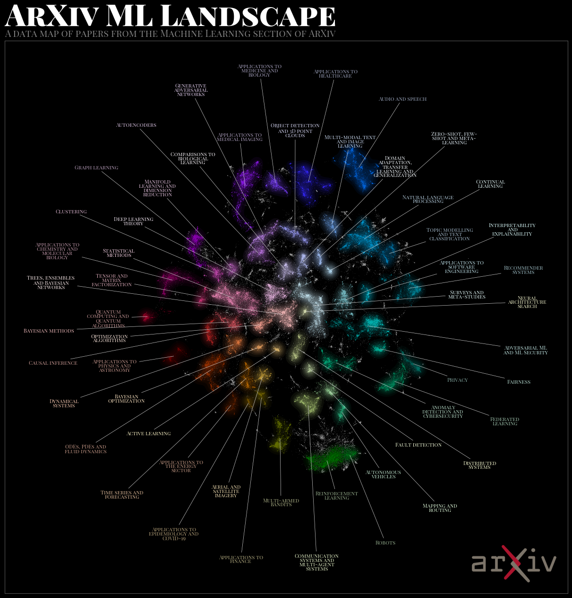
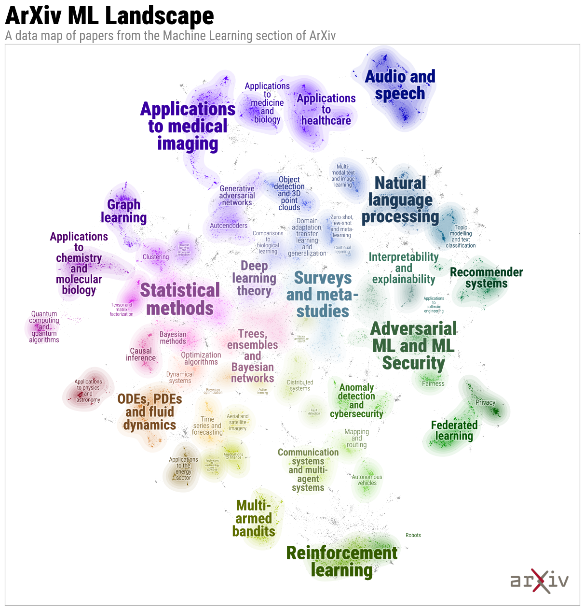
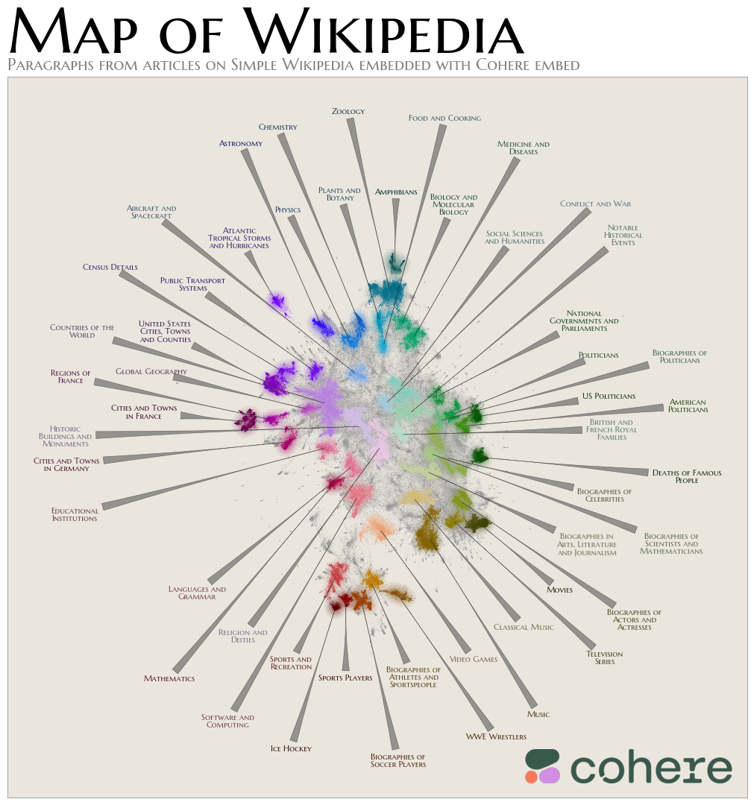
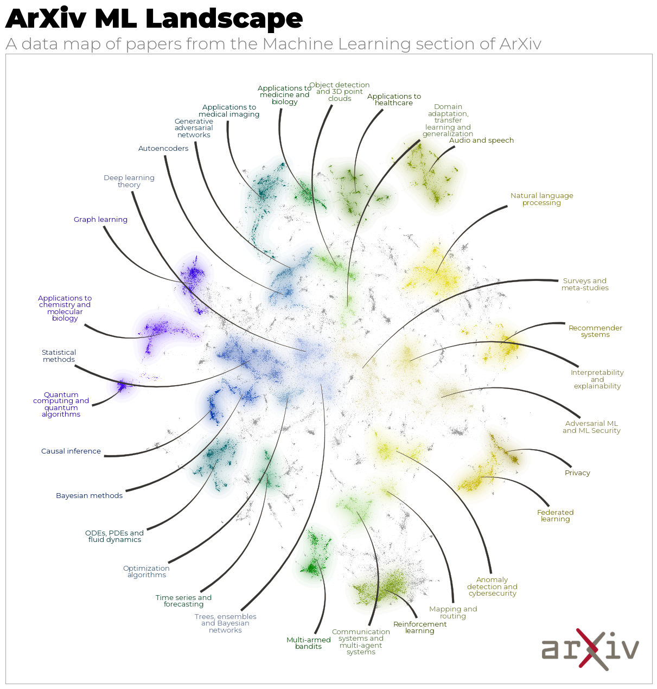

.. -*- mode: rst -*-

.. image:: doc/datamapplot_text_horizontal.png
  :width: 600
  :alt: DataMapPlot logo
  :align: center

|pypi_version|_ |pypi_downloads|_

|conda_version|_ |conda_downloads|_

|License|_ |build_status|_ |Coverage|_

|Docs|_

.. |pypi_version| image:: https://img.shields.io/pypi/v/datamapplot.svg
.. _pypi_version: https://pypi.python.org/pypi/datamapplot/

.. |pypi_downloads| image:: https://pepy.tech/badge/datamapplot/month
.. _pypi_downloads: https://pepy.tech/project/datamapplot

.. |conda_version| image:: https://anaconda.org/conda-forge/datamapplot/badges/version.svg
.. _conda_version: https://anaconda.org/conda-forge/datamapplot

.. |conda_downloads| image:: https://anaconda.org/conda-forge/datamapplot/badges/downloads.svg
.. _conda_downloads: https://anaconda.org/conda-forge/datamapplot

.. |License| image:: https://img.shields.io/pypi/l/datamapplot.svg
.. _License: https://github.com/TutteInstitute/datamapplot/blob/master/LICENSE.txt

.. |build_status| image:: https://dev.azure.com/TutteInstitute/build-pipelines/_apis/build/status/lmcinnes.umap?branchName=master
.. _build_status: https://dev.azure.com/TutteInstitute/build-pipelines/_build/latest?definitionId=2&branchName=master

.. |Coverage| image:: https://img.shields.io/azure-devops/coverage/TutteInstitute/build-pipelines/22.svg
.. _Coverage: https://dev.azure.com/TutteInstitute/build-pipelines/_build/results?buildId=1445&view=codecoverage-tab

.. |Docs| image:: https://readthedocs.org/projects/datamapplot/badge/?version=latest
.. _Docs: https://datamapplot.readthedocs.io/en/latest/?badge=latest

===========
DataMapPlot
===========

Creating beautiful plots of data maps. DataMapPlot is a small library designed to help you make beautiful data map
plots for inclusion in presentations, posters and papers. The focus is on producing static plots,
or simple interactive plots, that are great looking with as little work for you as possible. All you need to do is
label clusters of points in the data map and DataMapPlot will take care of the rest. While this involves automating
most of the aesthetic choices, the library provides a wide variety of ways to customize the resulting
plot to your needs.

--------------------
Static Plot Examples
--------------------

Some examples of the kind of output that DataMapPlot can provide.

A basic plot, with some highlighted labels:

.. image:: examples/plot_cord19.png
   :width: 1024
   :alt: A data map plot of the CORD-19 dataset
   :align: center

Using darkmode and some custom font choices:

With labels over points in a word-cloud style:

Alternative custom styling:

Custom arrow styles, fonts, and colour maps:

-------------------------
Interactive Plot Examples
-------------------------

Some example videos of interacting with the interactive html plots.

.. image:: examples/ArXiv_example.gif
   :width: 640px
   :alt: Animation of searching and zooming on ArXiv data

.. image:: examples/CORD19_example.gif
   :width: 640px
   :alt: Animation of zooming and panning on CORD19 data

.. image:: examples/Wikipedia_example.gif
   :width: 640px
   :alt: Animation of panning and zooming on Wikipedia data

.. image:: examples/CORD19_custom_example.gif
   :width: 640px
   :alt: Animation of searching and zooming on CORD19 data

-----------
Basic Usage
-----------

DataMapPlot is very easy to use. There are essentially only two functions: `create_plot` and
`create_interactive_plot`. They take coordinates of a data map, and an array or list of labels
for the data points. A variety of further options can be used to customise the output.
A basic example might look something like:

.. code:: python

    import datamapplot

    datamapplot.create_plot(data_map_coords, data_map_labels, **style_keywords)

Please see the documentation for full details on usage and options.

-------------
Documentation
-------------

Full documentation for DataMapPlot is available on
`ReadTheDocs <https://datamapplot.readthedocs.io/>`_.

------------
Installation
------------

DataMapPlot requires a few libraries, but all are widely available and easy to install:

 * Numpy
 * Matplotlib
 * Scikit-learn
 * Pandas
 * Datashader
 * Scikit-image
 * Numba
 * Requests
 * Jinja2

To install DataMapPlot you can use pip:

.. code:: bash

    pip install datamapplot

or use conda with conda-forge

.. code:: bash

    conda install -c conda-forge datamapplot

-------
License
-------

DataMapPlot is MIT licensed. See the LICENSE file for details.

----------------
Help and Support
----------------

Documentation is at `Read the Docs <https://datamapplot.readthedocs.io/>`_.
The documentation `includes a FAQ <https://datamapplot.readthedocs.io/en/latest/faq.html>`_ that
may answer your questions. If you still have questions then please
`open an issue <https://github.com/TutteInstitute/datamapplot/issues/new>`_
and I will try to provide any help and guidance that I can. Please read
the `code of conduct <https://github.com/TutteInstitute/datamapplot/blob/main/CODE_OF_CONDUCT.md>`_
for acceptable behaviour in issue and PR discussions.

------------
Contributing
------------

Contributions are more than welcome! If you have ideas for features or projects please get in touch. Everything from
code to notebooks to examples and documentation are all *equally valuable* so please don't feel you can't contribute.
To contribute please `fork the project <https://github.com/TutteInstitute/datamapplot/issues#fork-destination-box>`_ make your
changes and submit a pull request. We will do our best to work through any issues with you and get your code merged in.

We would like to note that the DataMapPlot package makes heavy use of
NumFOCUS sponsored projects, and would not be possible without
their support of those projects, so please `consider contributing to NumFOCUS <https://www.numfocus.org/membership>`_.

