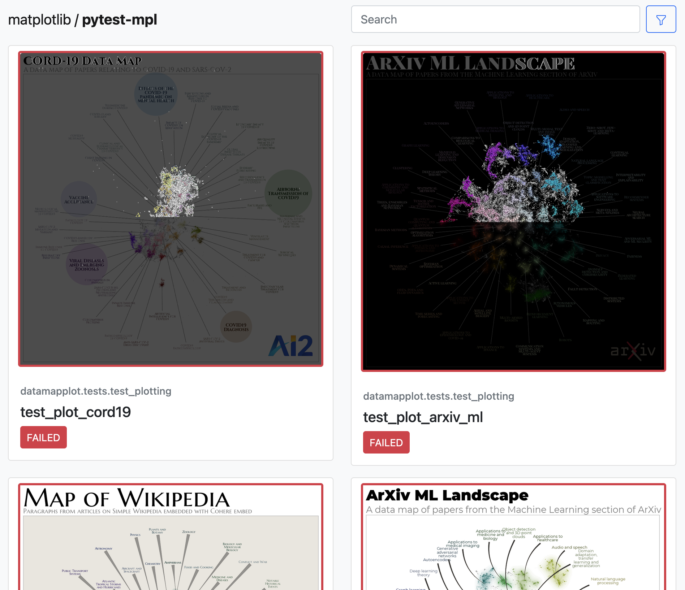

Accessing CI Test Reports
=========================

This guide shows how to access test artifacts, including the pytest-mpl reports and Playwright reports, from Azure Pipelines CI runs.

Finding Test Reports in Azure Pipelines
---------------------------------------

Step 1: Access the Azure Pipelines Build
~~~~~~~~~~~~~~~~~~~~~~~~~~~~~~~~~~~~~~~~

Navigate to the `Azure Pipelines page <https://dev.azure.com/TutteInstitute/build-pipelines/_build?definitionId=22>`_ for the DataMapPlot repository. Click on the build you want to examine.

   Figure 1: Azure Pipelines main page showing recent builds.

Step 2: View Build Summary
~~~~~~~~~~~~~~~~~~~~~~~~~~

From the build summary page, you can see the overall status of the build, including which jobs passed or failed. Click on the "N published" button under "Related" in the build summary page (N is the number of artifacts published). If no artifacts have been published, it will say "0 artifacts" and be greyed out.

   Figure 2: Build summary page.

Step 3: Select the Artifact Package
~~~~~~~~~~~~~~~~~~~~~~~~~~~~~~~~~~~

On the artifacts page, you can see a list of available artifact packages to download.

For static image test results, choose an artifact package named ``mpl-test-results-*``.
For Playwright reports, choose an artifact package named ``playwright-report-*``.

The exact names will include build ID and environment details, for example:

- ``mpl-test-results-12345-Linux-py3.10``
- ``playwright-report-12345-Darwin-py3.11``

   Figure 3: Select the appropriate artifact package.

Examining Matplotlib Visual Test Results
----------------------------------------

Step 1: Navigate the Artifact Structure
~~~~~~~~~~~~~~~~~~~~~~~~~~~~~~~~~~~~~~~

After downloading a pytest-mpl test report artifact, you'll see a directory structure containing test report. Open the ``fig_comparion.html`` file in a web browser to view the test results. The summary page shows a visual overview of all of the tests, including which passed and which failed.

   Figure 4: Summary of mpl test results that have passed.

Step 2: Review the Report Summary
~~~~~~~~~~~~~~~~~~~~~~~~~~~~~~~~~
Select a test to examine the diffs and to understand what changed between the baseline and the result.

   Figure 5: Detailed view of an mpl test that passed.

Step 3: Analyze Differences
~~~~~~~~~~~~~~~~~~~~~~~~~~~

If a test fails, you can look at the diff to see what's changed.

   Figure 6:  Summary of mpl test results that have failed.

   Figure 7: Detailed view of a diff image showing areas of change.

Examining Playwright Test Reports
---------------------------------

Step 1: Open the Playwright Report
~~~~~~~~~~~~~~~~~~~~~~~~~~~~~~~~~~
After downloading a Playwright report artifact, open the ``index.html`` file.
The HTML report provides a summary of all the tests, showing which passed and which failed.

   Figure 8: Main view of a Playwright report.

Step 2: View Test Details
~~~~~~~~~~~~~~~~~~~~~~~~~
Click on a test to see details, including:

- Test steps and actions
- Error messages
- Screenshots at the point of failure
- Execution logs

   Figure 9: Summary view of Playwright test results.

Step 3: Examine Tests
~~~~~~~~~~~~~~~~~~~~~
If your test failed a visual diff, you can get detailed information from the report such as:

- The diff image
- The expected and actual screenshots
- The side by side view of the expected and actual screenshots
- The slider view

   Figure 10: Diff view of a failed Playwright test.

   Figure 11: Actual screenshot in a Playwright test report.

   Figure 12: SliderVisual comparison in a Playwright test report.