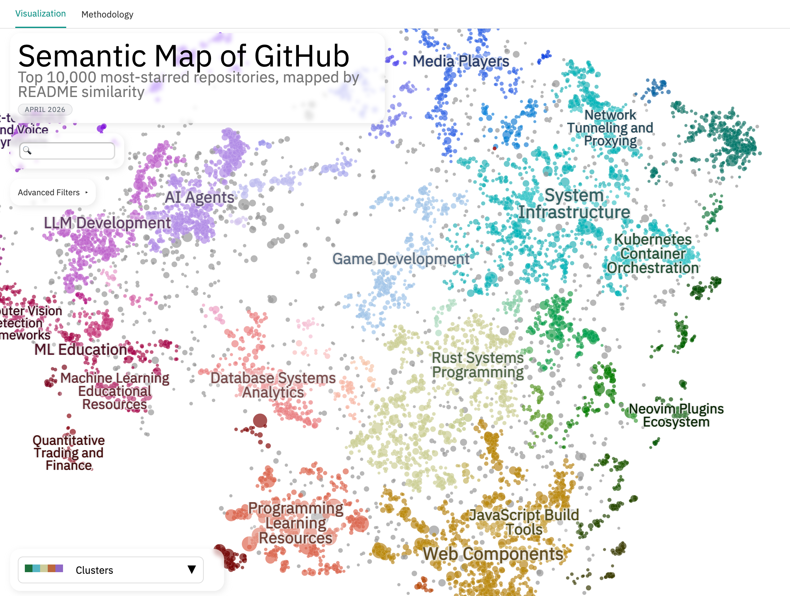
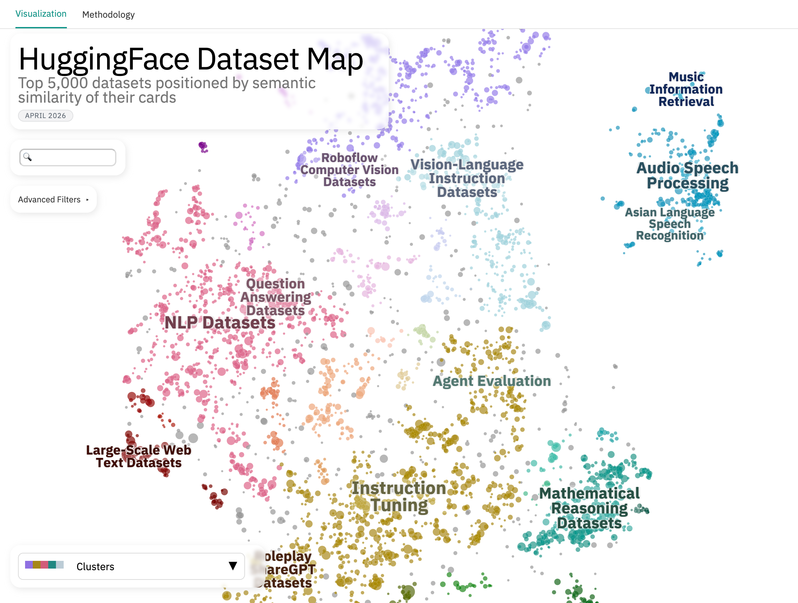
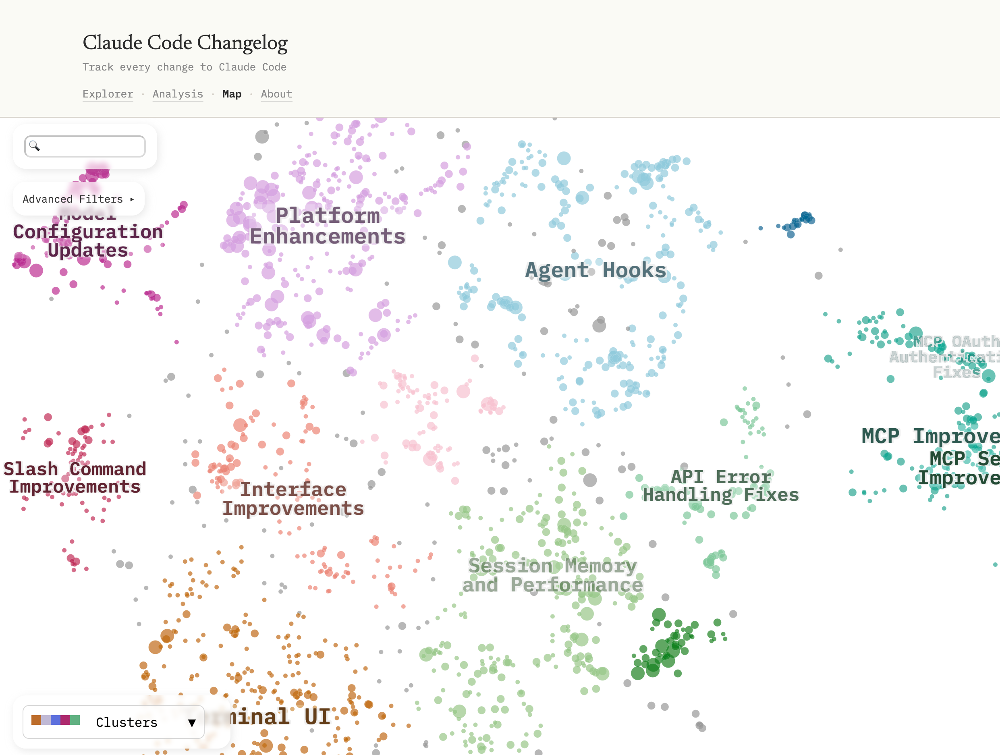
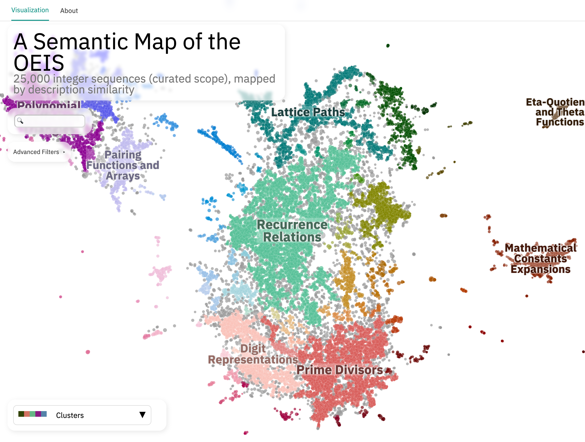
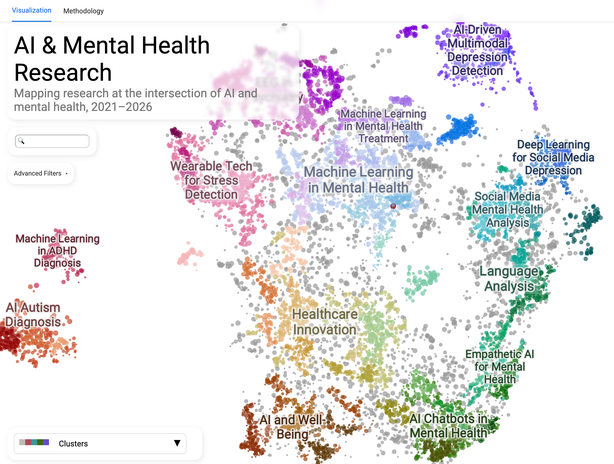

Community Projects
==================

A growing collection of interactive data maps built with DataMapPlot. Each
entry links to a live visualization and the source that produced it.

If you've built something with DataMapPlot that you'd like to share, see
:ref:`How to add your project` for a copy-pasteable template.

Semantic Map of GitHub
----------------------

*by* `Steven Fazzio <https://github.com/stevenfazzio>`__

An interactive map of the top 10,000 most-starred GitHub repositories,
positioned by semantic similarity of their READMEs. Eleven colormap layers
slice the map by raw GitHub signals (primary language, stars, license,
creation date) and LLM-derived ones (project type, target audience).

*Built with Cohere embed-v4.0 embeddings and Toponymy + Claude Sonnet for
topic labels.*

* `Live map <https://stevenfazzio.github.io/semantic-github-map/>`__
* `Source <https://github.com/stevenfazzio/semantic-github-map>`__
* `Methodology <https://stevenfazzio.github.io/semantic-github-map/methodology.html>`__

Semantic Map of HuggingFace Datasets
------------------------------------

*by* `Steven Fazzio <https://github.com/stevenfazzio>`__

An interactive map of the top 5,000 HuggingFace datasets, positioned by
semantic similarity of their dataset cards. Twelve colormaps span both HF
metadata (task, modality, license, language, likes, downloads) and
LLM-extracted classifications (subject domain, provenance, training stage,
format, benchmark vs. training role).

*Built with Cohere embed-v4.0 embeddings and Toponymy + Claude Sonnet for
topic labels.*

* `Live map <https://stevenfazzio.github.io/huggingface-dataset-map/>`__
* `Source <https://github.com/stevenfazzio/huggingface-dataset-map>`__

Claude Code Changelog Analysis
------------------------------

*by* `Steven Fazzio <https://github.com/stevenfazzio>`__

An interactive map of all entries in the Claude Code ``CHANGELOG.md``,
positioned by semantic similarity of the entry text. An example of mapping
a project's own development history rather than an external corpus, with
LLM-classified category, change type, complexity, and audience all available
as colormap layers.

*Built with Cohere embed-v4.0 embeddings and Toponymy + Claude Sonnet for
topic labels.*

* `Live map <https://stevenfazzio.github.io/claude-code-changelog-analysis/map.html>`__
* `Source <https://github.com/stevenfazzio/claude-code-changelog-analysis>`__

OEIS Semantic Map
-----------------

*by* `Steven Fazzio <https://github.com/stevenfazzio>`__

An interactive map of 25,000 curated integer sequences from the
`Online Encyclopedia of Integer Sequences <https://oeis.org/>`__,
positioned by semantic similarity of their textual descriptions. Useful for
navigating the OEIS by content similarity rather than by sequence number,
with an LLM-extracted taxonomy (math domain, sequence type, growth class,
origin era) available as colormap layers.

*Built with Cohere embed-v4.0 embeddings and Toponymy + Claude Sonnet for
topic labels.*

* `Live map <https://stevenfazzio.github.io/oeisdata-map/>`__
* `Source <https://github.com/stevenfazzio/oeisdata-map>`__

AI & Mental Health Research
---------------------------

*by* `Steven Fazzio <https://github.com/stevenfazzio>`__

An interactive map of five years of research papers at the intersection of
artificial intelligence and mental health, sourced from Semantic Scholar.
Useful for surveying the landscape of AI applied to mental health, with
bibliometric colormaps (citations, influential citations, h-index, year)
for surfacing well-cited or recent work in any subfield.

*Built with SPECTER v2 embeddings (purpose-built for scientific text) and
Toponymy + GPT-4o for topic labels.*

* `Live map <https://stevenfazzio.github.io/mh-ai-research/>`__
* `Source <https://github.com/stevenfazzio/mh-ai-research>`__

How to add your project
-----------------------

If you've built something with DataMapPlot that you'd like to share, please
open a pull request adding an entry to this page.

Each entry has:

* A title and short description (one to three sentences)
* A link to the live visualization and to the source repository
* A static screenshot (PNG, at least 1440 px wide so it stays sharp on
  Retina) placed under ``doc/images/community/``
* Optionally, an italic one-liner naming the key tools or methods that
  distinguish your map (e.g., embedding model, topic-labeling LLM,
  clustering library, custom widget)

You can copy the following template as a starting point. Place your entry
wherever fits best alongside the existing ones:

.. code-block:: rst

   Project Name
   ------------

   *by* `Your Name <https://github.com/your-handle>`__

   .. image:: images/community/your_project.png
      :width: 720
      :alt: Brief alt text describing the visualization
         :target: https://your-live-map-url/

   One to three sentences describing what your project maps and what makes
   it interesting.

   *Built with [the key tools or methods that shape your map].*

   * `Live map <https://your-live-map-url/>`__
   * `Source <https://github.com/your-handle/your-repo>`__

If this is your first time contributing to an open-source project, the
`contributing guide <https://github.com/TutteInstitute/datamapplot/blob/main/CONTRIBUTING.md>`__
walks through forking the repository, building the docs locally, and opening
a pull request. Feel free to ask in the PR discussion if anything is unclear.
